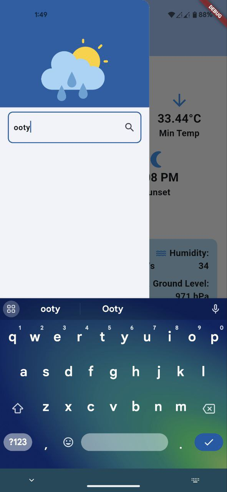

# Flutter Weather Forecast


A Flutter app for checking weather forecasts using the OpenWeatherMap API.

## Features

- Display current weather conditions for your current location or a specified city.
- Switch between Celsius and Fahrenheit temperature units.
- View sunrise and sunset times.
- Get a 7-day weather forecast.
- Search for weather conditions in different cities.

## Screenshots





## Installation

1. Clone this repository.

```bash
git clone https://github.com/your-username/flutter-weather-forecast.git
cd flutter-weather-forecast
flutter pub get
flutter run
